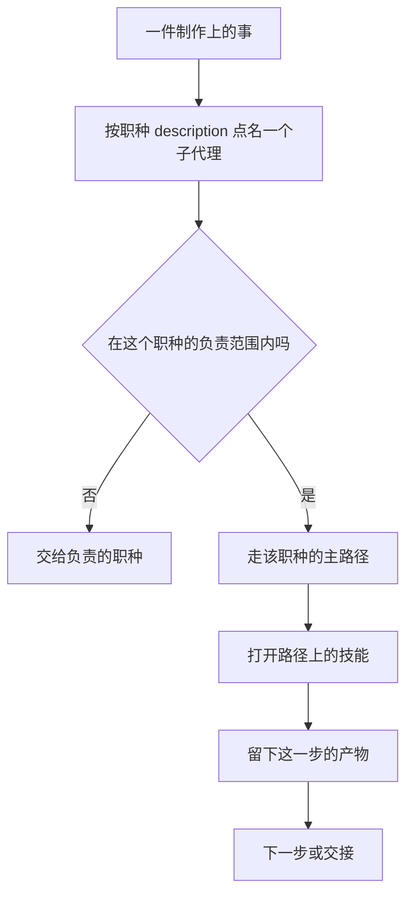

# Game Studio Skills

这是对**游戏制作行业职种**的蒸馏。35 个职种子代理按岗位边界干活，106 条技能是这些岗位会打开的工作流。装进 Cursor 之后，一件事先落到某个职种，再按该职种的主路径去做，越界就交接。

正文是中文。职种来自制作、系统数值、叙事关卡、工程、品质、美术音频，不是通用编程助手。

## 安装

在 Cursor 里打开 **Customize**，从 GitHub 导入：

`https://github.com/limoaCatherine/game-studio-skills`

插件名是 `game-studio-skills`。子代理在 `agents/`，技能在 `skills/`。

只给一个项目用时，把 `agents/` 拷到该项目的 `.cursor/agents/`，把 `skills/` 拷到 `.cursor/skills/`。

## 职种怎么接一件事



每个子代理都写明三件事：负责什么、不负责什么、主路径上挂哪几条技能。技能再写步骤、做到什么算完、失败回到哪一步。

职种名单在 [ROLES.md](ROLES.md)。技能名单在 [CATALOG.md](CATALOG.md)。

## 和别人的仓库差在哪

星标取自 GitHub API，时间是 2026-09-24。对方仓库里的条数用的是该仓库自己的说明，没有逐文件重数。

| | 本仓库 | [GameStudio](https://github.com/bullish0x/GameStudio) | [OpenAgenticGame-Studios](https://github.com/wanghaisheng/OpenAgenticGame-Studios) | [agent-studio](https://github.com/smashandclash/agent-studio) |
|---|---|---|---|---|
| 星标 | 0 | 14 | 15 | 1 |
| 最近推送 | 2026-09-24 | 2026-06-13 | 2026-06-03 | 2026-04-24 |
| 自述规模 | 35 个职种子代理，106 条技能 | 55 agents，182 skills | 85 agents，72 skills | 领导层、部门负责人和专家，外加工作流命令 |
| 蒸馏的是什么 | 制作岗位的边界和步骤 | 多宿主工作室，含引擎向技能 | 九个队的通用参考层 | 跨宿主的协作协议和流程命令 |
| 引擎工程 | 不带 Godot、Unity、Unreal 或网页引擎模板 | Godot、Unity、Unreal、Three.js、PixiJS、Phaser、R3F | 平台认证与多宿主参考 | Godot、Unity、Unreal、Web |
| 语言 | 中文职种步骤 | 英文 | 中英 | 英文 |
| 怎么装进 Cursor | 本仓库就是 Cursor 插件 | 用 `.cursor/` 适配同一套 `.agents/` | 通过参考层接到 Cursor | 用 `.cursor/` 适配 |

GameStudio 和 OpenAgenticGame-Studios 的星标更高，覆盖的引擎和岗位也更宽。本仓库不跟他们比引擎脚手架。这里蒸馏的是岗位：战斗策划不改数值表，数值策划不写手感清单，原画不导出模型。主路径把活交给下一条技能，而不是在一个大提示词里做完所有部门。

整套会话、规则和安装器仍在 [game-studio-harness](https://github.com/limoaCatherine/game-studio-harness)（4 星，2026-09-20）。本仓库是从那里拆出的职种和技能，给不想部署整套运行时的人用。

## 和 Harness 怎么分

| | 本仓库 | game-studio-harness |
|---|---|---|
| 职种 | 35 个子代理，可单独点名 | 同一批职种，由会话加载 |
| 技能 | 106 条步骤 | 同一批技能 |
| 没有的 | 安装器、会话目录、外接进程 | 不把职种再包一层插件 |

导演类技能会写 `.harness/sessions/` 一类路径。没装 Harness 时，职种仍按边界和步骤做；那些会话文件要自己有目录，或改记在项目笔记里。表格写入对接本机的 [excel-sovereign-mcp](https://github.com/limoaCatherine/excel-sovereign-mcp)。本仓库不附带 Excel、FMOD、引擎或任何外接进程。

## 仓库里有什么

```text
agents/<id>.md                 35 个职种子代理
skills/<id>/SKILL.md           106 条工作流
ROLES.md                       职种目录
CATALOG.md                     技能目录
.cursor-plugin/plugin.json     插件清单
.cursor-plugin/marketplace.json
```

## 许可

[MIT](LICENSE)。职种和技能正文来自 game-studio-harness，同一许可。
