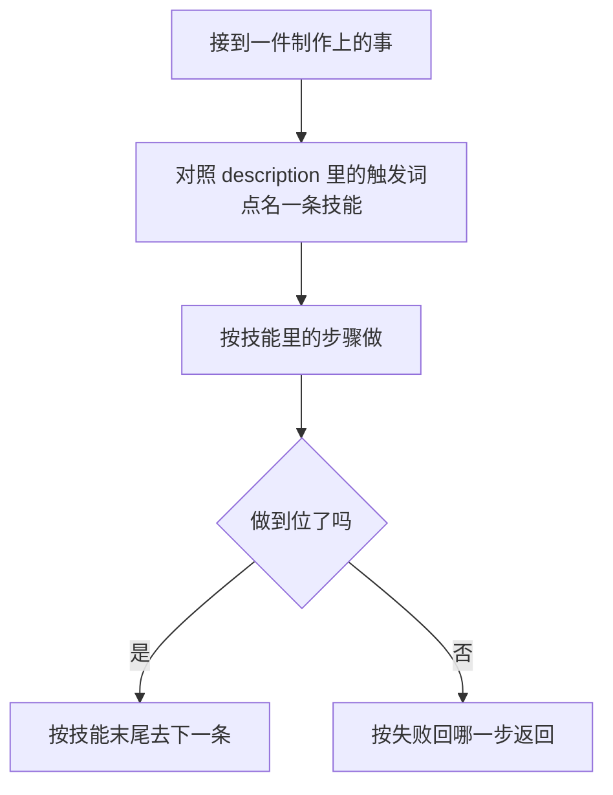

# Game Studio Skills

从 [game-studio-harness](https://github.com/limoaCatherine/game-studio-harness) 拆出来的 **106** 条生产流程技能，打包成 Cursor 插件。别人装上之后，代理按同一套做法做事：什么时候用、分几步、做到什么算完、失败回到哪一步、下一步接哪条技能。

技能正文是中文。目录名是技能 id。

## 安装

在 Cursor 里打开 **Customize**，从 GitHub 导入这个仓库：

`https://github.com/limoaCatherine/game-studio-skills`

仓库根的 `.cursor-plugin/marketplace.json` 会列出插件 `game-studio-skills`。安装范围选用户或当前项目。

只想给某一个仓库用时，把本仓库的 `skills/` 拷进那个项目的 `.cursor/skills/`。Cursor 会按每条技能的 `description` 决定何时读它。

## 一条技能怎么被用上



每条技能都是这个形状：何时用、边界、步骤、做到的证据、失败回哪一步、下一步常接谁。代理不另写一套流程。

## 和 Harness 怎么分

| | game-studio-skills | game-studio-harness |
|---|---|---|
| 里面有什么 | 106 条 `SKILL.md` | 规则、职种、会话、外接档位、安装器 |
| 给谁 | 只想要规范化做法的人 | 要整套工作室运行时的人 |
| 怎么装 | Cursor 插件，或拷进 `.cursor/skills/` | 按 Harness 的安装脚本部署 |

导演类技能会写 Harness 的会话文件，例如 `.harness/sessions/`、`loadplan.json`、`catalog.json`。这 9 条是：`route-task`、`assemble-craft-flow`、`doctor`、`verify-gate`、`sync-state`、`artifacts-append`、`handoff-pack`、`collab-protocol`、`status-digest`。

没装 Harness 时，其余技能仍然按步骤执行。表格类技能里的写入，对接本机的 [excel-sovereign-mcp](https://github.com/limoaCatherine/excel-sovereign-mcp)。本仓库不附带 Excel、FMOD、引擎或任何外接进程。

## 技能地图

完整表在 [CATALOG.md](CATALOG.md)。

| 组 | 在管什么 |
|---|---|
| 导演与收口 | 点名、排序、核对、交接 |
| 记忆与晋升 | 开工前检索，批准后写入决策 |
| 写隔离与目录 | 先写隔离区，再按目录归档 |
| 表格 | 读表、排版、沙盒改表、晋升 |
| 方向与范围 | 支柱、砍范围、GDD、竖切、里程碑 |
| 战斗与数值 | 战斗模型、技能包、属性、公式、成长 |
| 经济与商业化 | 产销、物价、通胀、内购、KPI |
| 叙事关卡体验 | 节拍、任务、对白、灰盒、UI |
| 美术音频技美 | 风格、资产、绑定、LOD、FMOD、导入 |
| 工程与测试 | 缺陷、契约、存档、冒烟、回归、提审 |
| 活服与外接 | 活动日历、发奖、命名、图、工具规格 |

## 仓库里有什么

```text
.cursor-plugin/plugin.json        插件清单
.cursor-plugin/marketplace.json   供 Cursor 从 GitHub 安装
skills/<id>/SKILL.md              106 条技能
CATALOG.md                        按组列出的目录
```

`artifacts-append` 和 `handoff-pack` 的 `name` 与目录名对齐，方便 Cursor 按 id 加载。正文步骤没有改。

## 许可

[MIT](LICENSE)。技能正文来自 game-studio-harness，同一许可。
